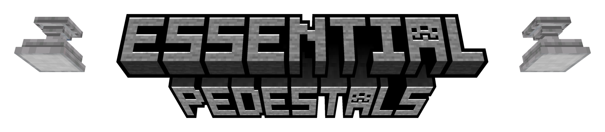

  

  
  
	

  

<h2>About</h2>

  Essential Pedestals adds a simple pedestal block that can hold and display a single item.

<h2>Features</h2>

<ul>
  <li>Place a pedestal to display a single item in the world</li>
  <li>Right-click the pedestal with an item to place it on the pedestal</li>
  <li>Right-click the pedestal with an empty hand to remove the displayed item</li>
  <li>Sneak and right-click the pedestal with an empty hand to open the pedestal interface</li>
  <li>The displayed item is rendered above the pedestal and can be viewed from all sides</li>
</ul>

<h2>Compatibility</h2>

<table border="1" cellpadding="6" cellspacing="0">
  <thead>
    <tr>
      <th>Version</th>
      <th>Loader</th>
      <th>Supported?</th>
    </tr>
  </thead>
  <tbody>
    <tr>
      <td>1.21.1</td>
      <td>Fabric</td>
      <td>✔</td>
    </tr>
    <tr>
      <td>1.21.1</td>
      <td>Forge / NeoForge / Other</td>
      <td>✘</td>
    </tr>
    <tr>
      <td>1.21 and below</td>
      <td>Fabric / NeoForge / Forge / Other</td>
      <td>✘</td>
    </tr>
    <tr>
      <td>1.21.2 and above</td>
      <td>Fabric / NeoForge / Forge / Other</td>
      <td>✘</td>
    </tr>
  </tbody>
</table>

<h3>Dependencies</h3>

<ul>
  <li>
    <a href="https://modrinth.com/mod/fabric-api">Requires Fabric API</a>
  </li>
</ul>

<h2>Installation</h2>

<ol>
  <li>
    <a href="https://fabricmc.net/use/installer/">Install Fabric Loader</a> for any supported version
  </li>
  <li>
    <a href="https://modrinth.com/mod/fabric-api">Download Fabric API</a>
  </li>
  <li>
    Download Essential Pedestals from Modrinth or CurseForge
  </li>
  <li>
    Place the API and mod file into your <code>mods</code> folder
  </li>
  <li>
    Launch the game using the Fabric profile
  </li>
</ol>

<h2>Credits</h2>

<ul>
  <li>
    Thanks to
    <a href="https://www.youtube.com/channel/UCbzPhyLcO8VP25dZ7kaUyAw">Kaupenjoe</a>
    for the pedestal model and texture, as well as some of the code, and for teaching me and many others
  </li>
</ul>

</body>
</html>
